# px-overview



- [px-overview](#px-overview)
	- [Operation](#operation)
		- [全般](#全般)
			- [管理対象](#管理対象)
			- [利用者](#利用者)
		- [リポジトリ](#リポジトリ)
			- [`Repository`](#repository)
			- [`Description`](#description)
			- [`Type`](#type)
			- [`Issue`](#issue)
			- [`Pull Request`](#pull-request)
			- [`Wiki`](#wiki)
			- [`README.md`](#readmemd)
		- [チーム](#チーム)
		- [制限・禁止事項](#制限禁止事項)
		- [ルールやテンプレートに関する要望](#ルールやテンプレートに関する要望)
	- [Development](#development)
	- [Template](#template)

## Operation

Github に関する運用ルールです。

### 全般

#### 管理対象

-   社内向け業務システム
-   社内向け制作物
-   社外向け制作物
-   検証

#### 利用者

-   管理対象のソースを扱う社員（現状 DM 部/デザイン部のうち一部の社員）
-   一部社外の方

### リポジトリ

#### `Repository`

-   共通

    -   検証用リポジトリは、接頭に `dev-` をつける
    -   クライアント向けのリポジトリは、接頭に `{project code}-` をつける
    -   全角禁止
    -   単語はキャメルケース、名称全体はケバブケース*で記載する　　*-(ハイフン)で単語をつなぐ

-   構文（接頭以下）
    `[systemName | applicationName ] - [clientName | segment ] - [appId | function | project ] - [description]`

    -   systemName - 業務システム名（kintone, aws, slack, gas など）
    -   applicationName - アプリケーション名（業務システム以外）
    -   clinetName - クライアント名の略称
    -   segment - セグメントの略称（kintone:app, plugin, slack:tw など）\* gas:関連するシステム kintone や ss など
    -   appId/function/project - アプリ ID、機能名/プラグイン名、プロジェクト名などを略して記載
    -   description - その他補足（任意）

-   [Repository.md](./Repository.md)：サンプル等記載

#### `Description`

-   作成時にリポジトリの概要を記載する（日本語可）
-   構文

    ```
    [ systemCategory※ ] [ appName ] [ description ] [ ※運用終了年月(YYYY/MM/DD) ]
    ```

    -   systemCategory - システムカテゴリ。従業員管理、案件管理、情報システム、etc
    -   appName - アプリ名。プロジェクト管理、企業マスタ、etc
    -   description - アプリの概要
    -   運用終了年月 - 運用終了時に記載する。理由がある場合は理由を添える　 i.g 代替システム ◯◯ 運用開始のため

#### `Type`

-   社内アプリケーション
    -   リポジトリ作成時に `Private` を選択する
    -   運用終了時に `Archived`* にする `*リポジトリ Settings > Danger Zone > Archive`
-   社外アプリケーション
    -   ＃＃

#### `Issue`

-   開発における課題管理に利用する
-   ※細部要領は `Development`（開発ルール）に記載

#### `Pull Request`

-   レビュー・マージ管理に利用する
-   ※細部要領は `Development`（開発ルール）に記載

#### `Wiki`

-   検証時のメモ等に使用する
-   現状ルールは設けない..（よい使い方があったらご提案ください）

#### `README.md`

-   システム構成、スクリプト構成、大まかな制御フローなどソフトウェア申請準拠レベルの内容を記載する
-   Github 外のドキュメントがある場合は、そのリンクを貼る
-   ※細部要領は `Development`（開発ルール）に記載

### チーム

-   メンバーを追加した場合は、チームに所属させる

### 制限・禁止事項

-   `Project` は使用しない

### ルールやテンプレートに関する要望

-   本リポジトリ px-overview に Issue を立てる or MTG などで意見交換しましょう 🐥✨

## Development

## Template
